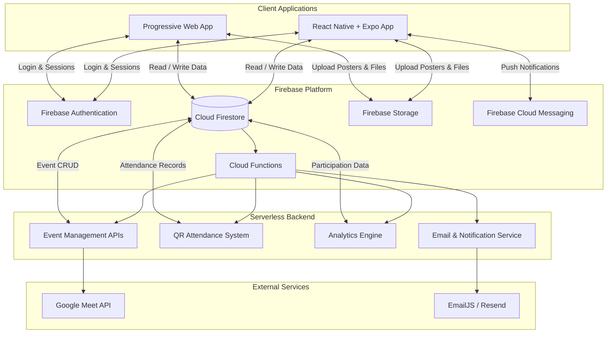

```mermaid
graph TD

    subgraph Client["Client Applications"]
        Mobile["React Native + Expo App"]
        Web["Progressive Web App"]
    end

    subgraph Firebase["Firebase Platform"]
        Auth["Firebase Authentication"]
        Firestore[("Cloud Firestore")]
        Storage["Firebase Storage"]
        FCM["Firebase Cloud Messaging"]
        Functions["Cloud Functions"]
    end

    subgraph Backend["Serverless Backend"]
        EventLogic["Event Management APIs"]
        QRSystem["QR Attendance System"]
        Analytics["Analytics Engine"]
        EmailService["Email & Notification Service"]
    end

    subgraph External["External Services"]
        GoogleMeet["Google Meet API"]
        EmailJS["EmailJS / Resend"]
    end

    Mobile <-->|Login & Sessions| Auth
    Web <-->|Login & Sessions| Auth

    Mobile <-->|Read / Write Data| Firestore
    Web <-->|Read / Write Data| Firestore

    Mobile <-->|Upload Posters & Files| Storage
    Web <-->|Upload Posters & Files| Storage

    Mobile <-->|Push Notifications| FCM

    Firestore --> Functions
    Functions --> EventLogic
    Functions --> QRSystem
    Functions --> Analytics
    Functions --> EmailService

    EventLogic <-->|Event CRUD| Firestore
    QRSystem <-->|Attendance Records| Firestore
    Analytics <-->|Participation Data| Firestore

    EmailService --> EmailJS
    EventLogic --> GoogleMeet
```
